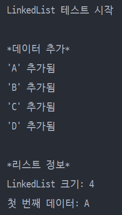
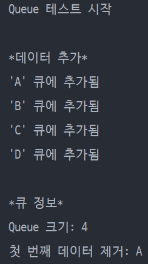
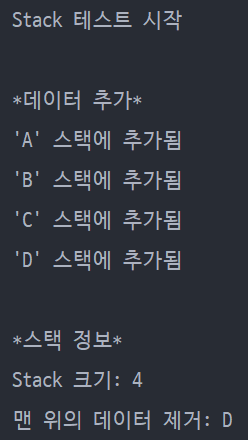

# 08. LinkedList.LinkedList 구현하기

### **_기본 과제_** 
add(): MyLinkedList 마지막 노드에 데이터를 추가 
get(index i): MyLinkedList i번째 노드의 데이터 리턴 
delete(index i): MyLinkedList i번째 노드의 데이터 삭제 
위 api 제공하며 data 타입은 LinkedList.LinkedList 생성시 정할 수 있도록 제네릭으로 구현합니다.
---
### **_하위 과제_** 
Iterator Interface를 Implements 한 이후 구현해 `for-each`로 순회 가능하도록 
MyLinkedList를 이용해 `Queue`, `Stack` 구현
 
 
---
 

# **_LinkedList_**
 
# **_Queue_**
 
# **_Stack_**
