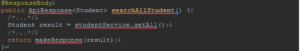

## 목표

공통 API 응답 모델과 에러 모델을 만들고, 간단한 성적 저장 및 조회하는 API를 구현합니다.

## 응답/에러 모델 예시
### 응답모델 예시

### 에러모델 예시

- `Status.code`: HTTP 상태 코드가 아닌, 서버에서 정의하는 코드 값이 포함되어야 합니다. 정상 응답에서는 항상 200이어야 합니다.
- `Status.message`: 정상 응답 시에는 "OK"를, 에러 응답에서는 에러에 대한 상세한 이유를 담습니다. 
- `Metadata.resultCount`: 정상 응답 시 나타나는 값으로, 결과 리스트의 개수를 담습니다. 
- `Results`: 정상 응답 시 나타나는 값으로, 항상 리스트 형태이며 실제 응답으로 내보낼 정보가 표시됩니다. 
- `Data`: 에러 응답 시 나타나는 값으로, 프론트엔드에서 사용자에게 요청이 거부된 이유를 쉽게 보여줄 수 있는 데이터를 포함합니다.

## API 요구사항
### 1. 이름과 성적을 입력받아 저장하는 API
   성적 입력 시 특정 값(6 이상일 경우)일 때 에러 응답을 반환해야 합니다.

### 2. 입력된 성적을 조회하는 API
   성적을 오름차순으로 조회해야 합니다.

### 3. 특정 성적을 입력받아 해당 성적의 학생만 조회하는 API

## 구현 요구사항
### 1. Controller에서 응답 모델을 작성

   `ApiResponse<T>`: 여러 데이터 타입(클래스)을 `result`로 넣을 수 있도록 제네릭을 사용하여 구현해야 합니다.
   `makeResponse(T result)`, `makeResponse(List<T> results)`: 결과를 응답 객체로 만들어주기 위한 메서드를 구현합니다. 단일 결과와 복수 결과 모두 응답 객체로 만들어줄 수 있도록 두 메서드를 구현해야 합니다.
### 2. 에러 응답을 만들기 위한 `@ExceptionHandler` 사용

   `@ExceptionHandler`를 사용해 예외 데이터를 처리하고 응답 모델로 변환합니다.
### 3. Custom Exception 구현

   `CustomException(ErrorCode, message, data)`를 사용하여 커스텀 예외를 처리해야 합니다. ErrorCode는 enum으로 정의합니다.
   예시: `ErrorCode`는 `enum`으로 정의되어야 합니다.

## 수행 기간
- 5일

## 결과물
- 응답/에러 모델을 구현한 코드

## 하위 과제
- 에러 응답에서 다양한 경우에도 `data`가 응답의 결과로 정상적으로 반환될 수 있도록 해야 합니다. 

- 필요한 API를 추가로 구현하고, API 요구사항에서 문제점이 발견될 경우 개선해 봅시다.